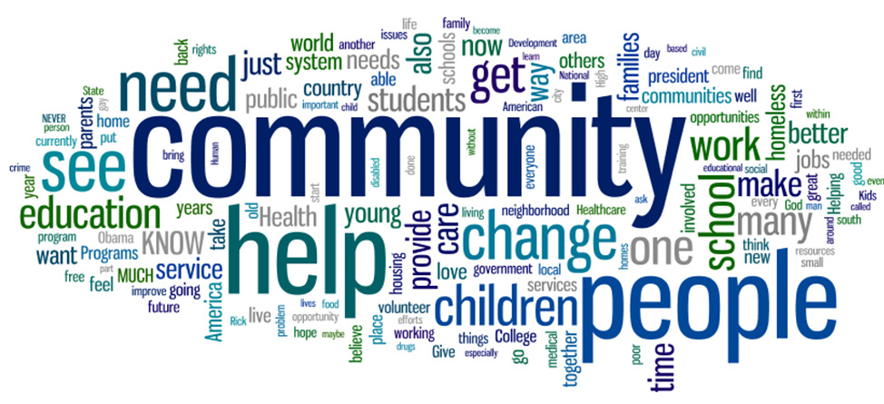

## Communities I'm running

### 1) Big Things

#### Focused in:
Big Data, Data Science & DevOps.

- [Meetup Group](https://www.meetup.com/Big-things-are-happening-here/)
- [YouTube channel](https://www.youtube.com/channel/UCBSNeufZ9msSjjIMB-BmqTQ)
- [Active Facebook group](https://www.facebook.com/groups/bigthingshere/)  

### 2) Google Developer Group Cloud (GDG Cloud):

#### Focused in:
Cloud Service Providers (Public, Private).

- [Meetup Group](https://www.meetup.com/GDG-Cloud-Tel-Aviv/)
- [YouTube channel](https://www.youtube.com/channel/UCcnE-nBd21aVtyVd1oAGotw)
- [Active Facebook group](https://www.facebook.com/groups/GDGCloudPlatforms/)  

### 3) Ofek Alumni Association

#### Focused in:
Startups, Technology, Entrepreneurship.

- [Meetup Group](https://www.meetup.com/Ofek-Alumni/)
- [YouTube channel](https://www.youtube.com/channel/UC_Jw37yBZM7vECbkOipExLA)
- [Active Facebook group](https://www.facebook.com/groups/265098610326594/)

 

 

