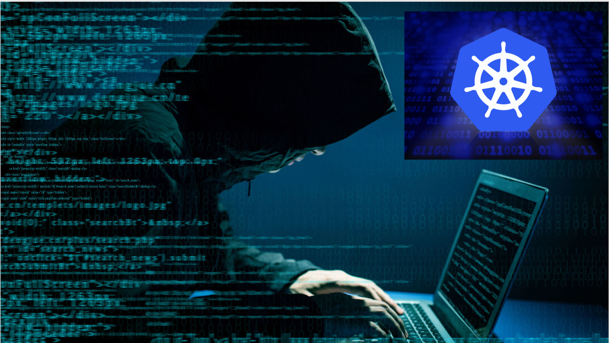

## Title
### Hacking for Fun & Profit: The Kubernetes Way

## Session duration

About 45 min

## Video

PyCon Israel 2018:  
Hacking for Fun & Profit: The Kubernetes Way - English

## Slides

- [Slideshre](https://www.slideshare.net/demibenari/hacking-for-fun-profit-the-kubernetes-way-tal-demi-at-panorays-pyconil-2018)

## Really Short Agenda (305 chars)

To defend against attacks, think like a hacker. But do you need to be a DevOps expert? 
Using Docker & Kubernetes we've allowed them to concentrate on writing hacker “tasks”. 
Saving DevOps hassle and removing 2 barriers: 
1) Long and risky deployment processes.
2) Low transparency within the production.

## Short Agenda (370 chars)

To defend against attacks, think like a hacker. But do you need to be a DevOps expert? 
Using Docker & Kubernetes on Google Cloud we've allowed them to concentrate on writing hacker “tasks”. 
Saving a lot of DevOps hassle and removing 2 barriers: 
1) Long and risky deployment processes.
2) Low transparency within the production.
Promise to share the stupid things too.

## Long Agenda

To defend against attacks, think like a hacker. But does that mean you need to be a DevOps expert? 
Security researchers today need to discover new attack techniques. 
However, much of their focus is diverged to backend coding. 
We share how to build an infrastructure for researchers that allows them concentrate on business logic and writing hacker “tasks”. 
Using Docker and Kubernetes on Google Cloud, these tasks can then be performed in parallel and without a lot of DevOps hassle. 
Our technique removes two common barriers: 
first, long and risky deployment processes and second, low transparency within the production system.

Promise to share the stupid things too.

## Target audience and level

Data engineers, DevOps engineers, Ops, SecOps.  
Intermediate level

- Infrastructure
- Backend
- Cyber Security

## Talk's Headline Photo

### Extra

What are the primary objectives of this session?
Kubernetes use-case which frees security professionals from the need to handle any infrastructure and easily write production-ready code.

What pain points are you planning to address?
1. Today’s security professionals need to develop production code, not only POCs.
2. Cyber-security risk modeling takes time
3. Job scheduling processes are typically performed in a sequential manner rather than efficient parallel scheduling.

What three to five takeaways would you share with your audience?
1. Remove security researchers from the need to write infrastructure code
2. Increase efficiency by running security activities in parallel
3. Generate more accurate risk modeling results through automation
